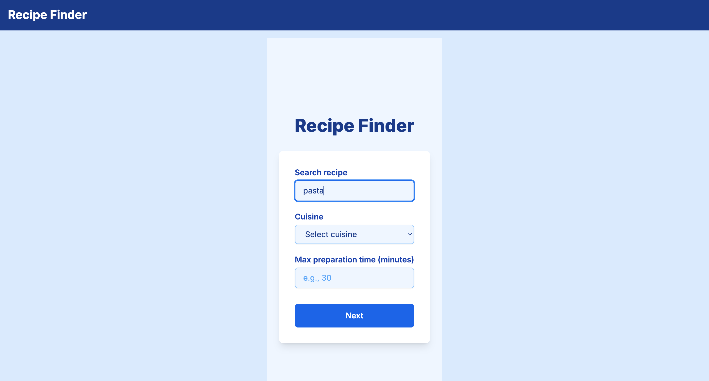
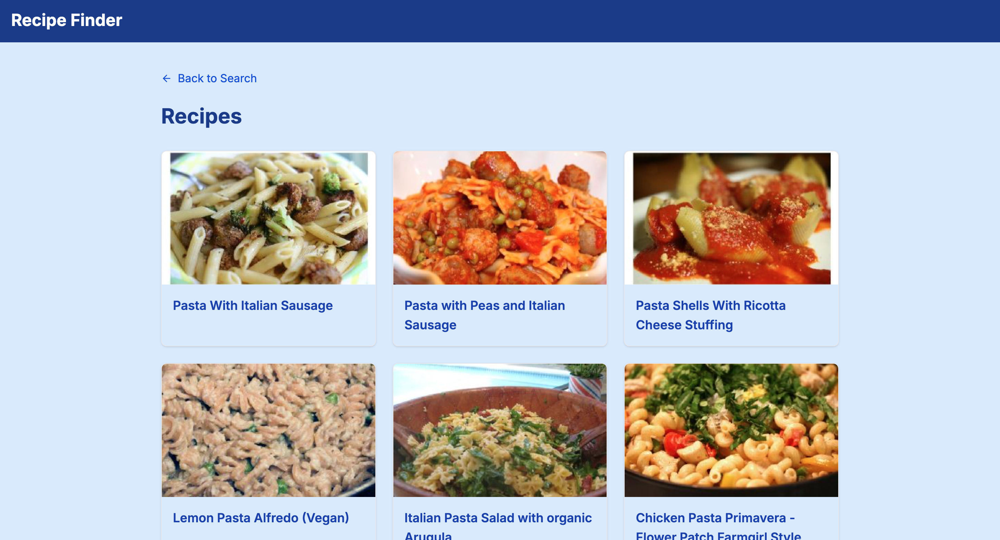
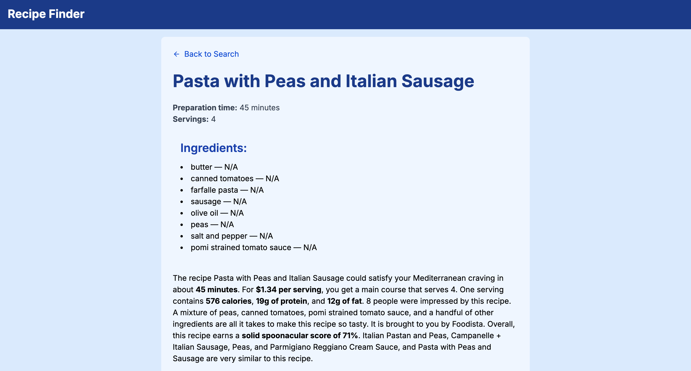

# Recipe Finder App

A sleek recipe search app built with **Next.js 14**, **Tailwind CSS**, and the **Spoonacular API**. Users can search recipes by keyword, cuisine, and preparation time — then view full recipe details including ingredients, summary, and timing.

## Features

- **Search recipes** by name, cuisine, or prep time
- **Filter results** by multiple criteria
- **Full recipe details** with ingredients, servings, and summary
- **Server-side rendering** (SSR) for faster initial loads
- **Styled with Tailwind CSS**
- **Loading state** with `react-spinners`
- **Clean code**, fully typed with TypeScript

---

## Build and Start (Production)
To build the application for production and start the server, run:

```bash
npm run build
npm run start
```

or with yarn:
```bash
yarn build
yarn start
```

or pnpm:
```bash
pnpm build
pnpm start
```

Run the development server:
```bash
npm run dev
# or
yarn dev
# or
pnpm dev
# or
bun dev
```

Open [http://localhost:3000](http://localhost:3000) with your browser to see the result.


## Project Structure

```bash
├── app/
│ ├── layout.tsx # Root layout: fonts, metadata, header/footer
│ ├── page.tsx # Home (search form)
│ └── recipes/
│       ├── loading.tsx  # Loading fallback for recipes list page
│       ├── page.tsx # Recipes list page (SSR)
│       └── [id]/
│             ├── page.tsx # Recipe details page
│             ├── loading.tsx  # Loading fallback for recipe details page
├── components/
│ └── Loading.tsx # Custom loading spinner
├── public/ 
├── .env.local # API key for Spoonacular
├── tailwind.config.ts 
├── next.config.js 
├── tsconfig.json 
└── README.md 
```


##  Tech Stack
- **Next.js 14 (App Router, SSR)**
- **React 18+ (Suspense)**
- **Tailwind CSS**
- **TypeScript**
- **react-spinners**
- **Spoonacular API**


## Features Error Handling
- **Shows user-friendly messages if the API fails or returns no results.**
- **Displays loading spinners while fetching data.**
- **Validates the search form to prevent empty or invalid input.**


## Screenshots

### 1. Search Form Screen
Description:
The search form includes:
- An input field for users to enter a recipe query.
- A dropdown with cuisine options.
- A numeric input for maximum preparation time in minutes.
- A search button that navigates to the recipes page.





### 2. Recipes Page Screen
Description:
- This screen shows the server-side rendering (SSR) implementation where the app fetches recipes from the Spoonacular API using the query parameters entered in the search form.
- The response data is cached for 1 minute to improve performance.
- The list of recipes returned by the API is displayed on this page, showing the recipe title and image.
- Recipes are displayed as a list with the title and image styled using Tailwind CSS.
- Clicking on a recipe navigates to the Recipe Details Page (recipes/[id]).
- Proper error handling is implemented to manage any data fetching issues gracefully.
- **Additionally, a back arrow button is implemented, which returns the user to the search form page.**





### 3. Recipe Details Page
Description:
-  This screen shows detailed information about a selected recipe.
- It renders the following information:
   - **Recipe title**
   - **Preparation time**
   - **Servings**
   - **List of ingredients**
   - **Summary**

- The page provides a clear, user-friendly layout styled with Tailwind CSS to showcase the recipe details.
- **Additionally, a back arrow button is implemented, which returns the user to the search form page.**


